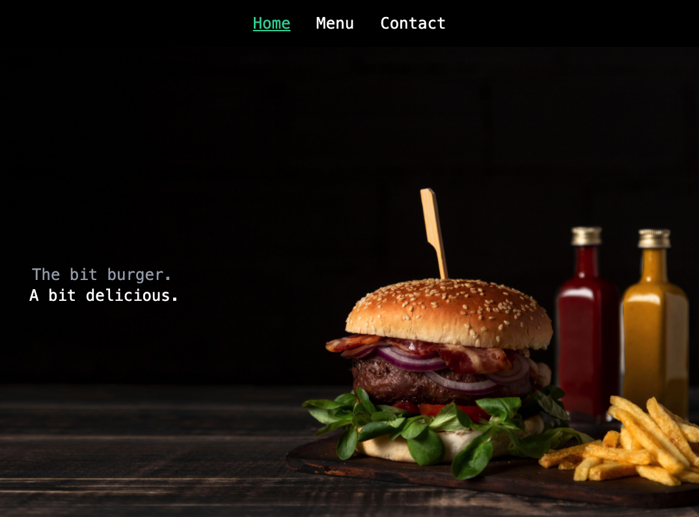

# Restaurant JS Page


> Single Page Application built with JS and Webpack for a Burger restaurant. 

## Screenshot



## Live Demo

🔗 [Live Demo Link](https://lirad.github.io/restaurant-page-js/#home)

## Description

This project has the goal to use ES6 features as modules and also implement Webpack to create build versions of the project.

## Built With 🛠

```
- Javascript
- Webpack
- HTML
- Tailwind CSS
```

## Install ⏳

> Follow these steps below to get my application working

1. - [ ] Git clone or download this repo to your machine
2. - [ ] Inside the `restaurant-page-js` folder run `npm install`
3. - [ ] Run `npx webpack` to create a build versions
4. - [ ] Navigate to the `dist`folder and run `index.html` inside your browser;


## Author

### 👨‍💻 Diego Lira
[](https://github.com/lirad) <br>
[](https://www.linkedin.com/in/diegoalira/) <br>
[](mailto:diegoalira@gmail.com) <br>


### 🤝 Contributing

Contributions, issues and feature requests are welcome!

Feel free to check the [issues page](enter issues url here).

## Acknowledgements

[https://www.behance.net/gallery/14286087/Twitter-Redesign-of-UI-details](https://www.behance.net/gallery/14286087/Twitter-Redesign-of-UI-details)

Design idea by [Gregoire Vella on Behance](https://www.behance.net/gregoirevella)

### Show your support

Give a ⭐️ if you like this project!

### License


